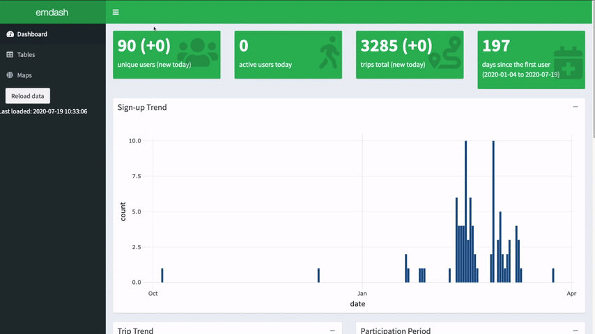

<!-- README.md is generated from README.Rmd. Please edit that file -->

```{r, include = FALSE}
knitr::opts_chunk$set(
  collapse = TRUE,
  comment = "#>",
  fig.path = "man/figures/README-",
  out.width = "100%"
)
```

# emdash

<!-- badges: start -->
[](https://github.com/asiripanich/emdash/actions)
[](https://zenodo.org/badge/latestdoi/280847367)
[](https://hub.docker.com/repository/docker/amarins/emdash)
<!-- badges: end -->

The goal of emdash is to provide a deployer dashboard for an e-mission deployment.

| **Tab**                                    | **Example**                                                               |
|--------------------------------------------|---------------------------------------------------------------------------|
| **Dashboard**                              |  |
| **Tables** (and interactive visualisation) |                                         |
| **Map**                                    |                                            |

## Installation

You can install emdash from GitHub:

``` r
install.packages("remotes")
remotes::install_github("asiripanich/emdash")
```

Alternatively, with Docker CLI:

    docker pull amarins/emdash
    docker run -d -p 80:80 --name emdash amarins/emdash

After that, open your favourite browser and type `localhost` or `http://0.0.0.0:80` in the URL bar to see the dashboard.

## How to use the dashboard

### Run locally

To use the dashboard you must config the port of your e-mission mongoDB in the `emdash::run_app(mongo_url = 'mongodb://localhost:27017')` command. As you can see, the default is `27017`. The easiest way to use this dashboard with your e-mission deployment is to create a SSH tunnel to the e-mission mongo on your e-mission server.

``` ssh
ssh -L {my-local-port}:localhost:{remote-server-port} username@your-server-ip-address-or-domain-name
ssh -L 27017:localhost:27017 ec2-user@123.12.12.1
```

Here is how you launch a e-mission dashboard with emdash.

``` r
library(emdash)
emdash::run_app(mongo_url = 'mongodb://localhost:27017')
```

## Loading test data

This repository contains a test mongodump with entries from the [e-mission unit test real data](https://github.com/e-mission/e-mission-server/tree/master/emission/tests/data/real_examples).

-   2016-07-22
-   2016-07-25
-   2016-07-27
-   2016-08-04
-   2016-08-05
-   2016-08-09
-   2016-08-10
-   2016-08-11

It includes background sensed data (`background/*`), analysis results (`analysis/*`) and the mode and purpose confirm objects from the master branch (`manual/mode_confirm` and `manual/purpose_confirm`).

To load the data into a local mongodb,

    $ unzip test-data/2016_jul_aug_test_trips.zip
    $ mongorestore

If you would like to load additional data, you can do so through the [e-mission server](https://github.com/e-mission/e-mission-server/#loading-test-data).

For convenience, you may use this `docker_start_test_mongodb.sh` for starting up a Docker container that will run the test database.

### Use with Docker

We provide a Dockerfile to run this dashboard. In the future we may include this as part of an e-mission docker-compose file which will be hosted on [the e-mission-docker github repo](https://github.com/e-mission/e-mission-docker).

Be warned that the emdash Docker image is quite large, around 2.8 GB, and take a while to build. You can use pull from [the emdash docker repository](https://hub.docker.com/r/amarins/emdash) and skip the wait!

## How to customise the dashboard

First you need to know [R](https://www.r-project.org/) and [Shiny](https://shiny.rstudio.com/). I tried to modularise each component as much as possible so that the dashboard is easy to be customised. Any advices to improve the dashboard are welcomed. :)

### Customise query functions

See `R/utils_query_database.R`.

The functions in this script are for querying data from the e-mission mongoDB database.

### Customise data

See `R/utils_tidy_data.R`.

The functions in this script are for cleansing and transforming data queried using the functions in `R/utils_query_database.R`.

# Citation

Use `emdash` in your work? Consider citing the package:

    @software{siripanich_amarin_2021_4456315,
      author       = {Siripanich, Amarin and
                      Rashidi, Taha and
                      Shankari, K},
      title        = {asiripanich/emdash: v1.2.3},
      month        = jan,
      year         = 2021,
      publisher    = {Zenodo},
      version      = {v1.2.3},
      doi          = {10.5281/zenodo.4456315},
      url          = {https://doi.org/10.5281/zenodo.4456315}
    }
